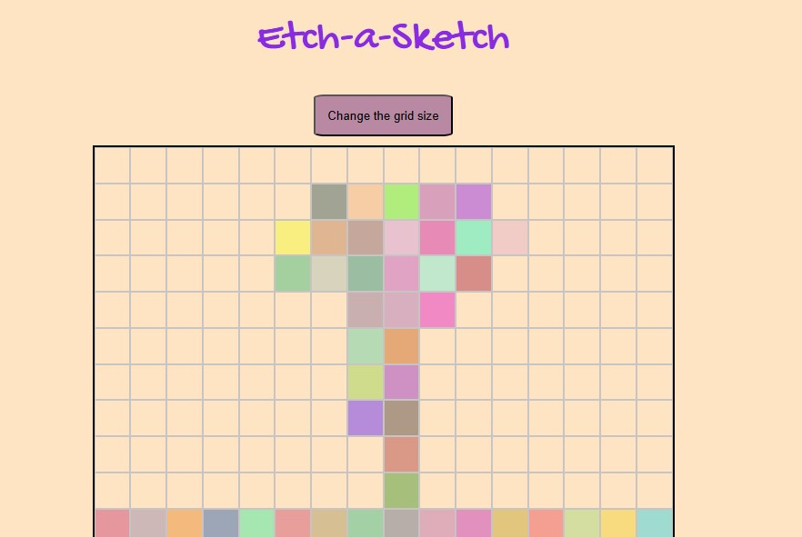

# 'Etch-a-Sketch' Project

This repository contains the solution for "Etch-a-Sketch" project from The Odin Project.

## Table of contents

- [Overview](#overview)
- [Links](#links)
- [Screenshots](#screenshots)
- [Technical Details](#technical-details)
  - [Built with](#built-with)
  - [How to Play](#how-to-play)
- [Credits](#credits)

## Overview

This project was assigned by [The Odin Project](https://www.theodinproject.com/), as part of Foundations Curse. 
It's a browser version of game between a sketchpad and an Etch-A-Sketch.

## Links

* Solution URL: [GitHub Repo](https://github.com/dinruz/etch-a-sketch)
* Live Site URL: [Etch-a-Sketch](https://dinruz.github.io/etch-a-sketch/)

## Screenshot

<table>
  <tr>
    <td align="center">
    
      
      
      
    </td>
</table>

## Technical Details 

### Built with 

* HTML5 
* CSS3 
* Vanilla JavaScript 
* Visual Studio Code

### How to Play

✏️ **Drawing (The Sketch)**

  * Simply move your cursor over the drawing grid. 
  
    Each square your cursor passes over will change color, leaving a permanent mark on the canvas.

🗑️ **Clearing the Canvas** 
 * Click the *"Clear"* button. 

   All squares are reset to their original background color, giving you a fresh canvas.

⊞  **Change Grid Size** 

  * Click the *"Set Grid Size"* button.
  * Enter a new numerical value (e.g., 50) when prompted to define the dimensions (50x50).The maximum is 100 (100x100).

  * The previous grid is removed, and a new grid is rendered with the specified size.

##  Credits

🔗 Author: [**dinruz**](https://www.github.com/dinruz) 

🔗 Instructions: [**The Odin Project**](https://www.theodinproject.com/lessons/foundations-etch-a-sketch) 

